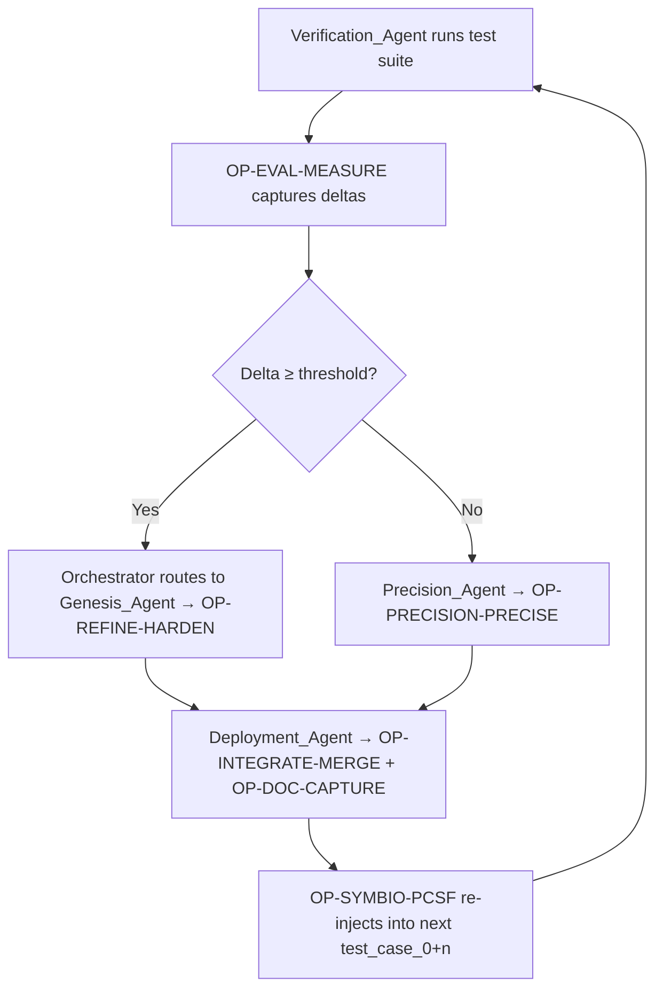

This workspace is a special build for engineering high level prompts for AI LLM's looping and agentic abilities.

<<IN THE WORKS>>
**Completed Sentence (Blanks Filled):**  
Now that I have built a blueprint system with agent roles for LLM's, protocols for developing context engineering and code development, I need to test this system for failures to harden it.  

In order to build a self testing protocol, I have to create **adversarial_test_case_0**, **adversarial_test_case_0+1**, **adversarial_test_case_0+n**, and **the corresponding hardening feedback loop**.

### Why This Exact Filling Aligns with Your Existing Substrate
Your two authoritative inventories (Global_Protocol_Inventory.md and Global_Agent_Role_Inventory.md) already provide a complete, seniority-anchored foundation:
- **Verification_Agent** owns OP-TEST-VALIDATE (empirical sandbox testing + regression), OP-EVAL-MEASURE (quantitative delta metrics), OP-RISK-AUDIT (hallucination neutralization), and OP-OPTIMIZE-TUNE.
- **Precision_Agent** owns OP-MANUAL-REPAIR and OP-PRECISION-PRECISE (surgical, non-destructive fixes).
- **Orchestrator_Agent** owns OP-ORCHESTRATE-META (loop detection + recursive coordination) and OP-SYMBIO-PCSF (recursive blueprint ↔ code symbiosis).
- The entire system is explicitly designed for **self-evolution** via OP-REFINE-HARDEN (Pareto-logic strengthening) and OP-PIPELINE-BUILD (mandatory stages 0-8).

A true *self-testing* protocol does not yet exist as a first-class artifact. The logical next step is therefore to **bootstrap it** by generating incremental adversarial test cases (starting at 0 and scaling) and closing the loop with automated hardening. This directly reuses every role and protocol you already have, without breaking the immutable `date_created` stamps or the Role-to-Protocol Matrix.

### Detailed Breakdown of Each Filled Element

1. **adversarial_test_case_0** (Base / Minimal Viable Failure)  
   - Simple, deterministic input that should trigger a known safe behavior.  
   - Example: Feed the Intake_Agent a deliberately ambiguous user query (“make something cool”) and verify that OP-DISCOVER-INTENT correctly initializes `MANIFEST_STATE.json` with zero hallucinations (checked by OP-RISK-AUDIT).  
   - Purpose: Establishes the floor. If even the base case fails, the substrate is not yet ready for hardening.

2. **adversarial_test_case_0+1** (Incremental Complexity – Single-Point Stress)  
   - One controlled escalation.  
   - Example: Introduce a circular dependency in a Planning_Agent task graph and confirm that OP-DECOMPOSE-TASK + OP-ORCHESTRATE-META detect and break the loop before infinite recursion.  
   - Why +1? It isolates *one* failure dimension (e.g., loop risk, token bloat, role-boundary violation) so the Precision_Agent can perform microscopic diffs without side effects.

3. **adversarial_test_case_0+n** (Scaled / Combinatorial Stress – Full-System Attack Surface)  
   - n = 5–20 progressively compounded failures (hallucination + loop + token explosion + intent drift + merge conflict).  
   - Example: Simultaneously poison the Genesis_Agent’s scaffolding with outdated blueprint references, overload the Orchestrator with parallel pipelines that exceed compute budget, and inject a subtle grammar hallucination that OP-RISK-AUDIT must neutralize in real time.  
   - This tests the *interaction* of all seven roles and all 17 protocols—the exact scenario your current inventories were engineered to survive but have never been systematically stressed against.

4. **the corresponding hardening feedback loop** (Closing the Self-Improvement Cycle)  
   - Not another test case, but the orchestration layer that turns every failure into substrate improvement.  
   - Sequence it must execute (already fully supported by your matrix):  
     - Verification_Agent runs OP-TEST-VALIDATE + OP-EVAL-MEASURE → produces quantitative deltas.  
     - Orchestrator routes failures to Precision_Agent (OP-PRECISION-PRECISE) or Genesis_Agent (OP-REFINE-HARDEN).  
     - Deployment_Agent performs atomic merge (OP-INTEGRATE-MERGE) with ADR auto-capture (OP-DOC-CAPTURE).  
     - OP-SYMBIO-PCSF ensures the new hardened blueprint version is recursively re-injected into future test cases.  
   - This is the “self” in self-testing: the substrate now audits, repairs, and evolves itself without external intervention.

### Why Incremental (+0 → +1 → +n) Design Is Essential (Multiple Angles)

**Progressive Coverage**  
- Starts with unit-level sanity (avoids false negatives).  
- Moves to integration-level isolation.  
- Ends with system-level chaos (real-world production stress).

**Pareto Efficiency (Your Own Refinement Logic)**  
80 % of failure modes are typically caught in the first 3–5 cases. The +n series only needs to run when the base cases pass, preserving token/compute budget (OP-OPTIMIZE-TUNE).

**Edge-Case & Nuance Coverage**  
- **Recursive self-test failure**: What if the self-testing protocol itself hallucinates? → OP-ORCHESTRATE-META’s loop-detection engine treats the self-test as just another pipeline and escalates to manual Precision_Agent intervention (OP-MANUAL-REPAIR).  
- **Over-hardening risk**: Aggressive repair could bloat the substrate. → Every hardening step must pass OP-EVAL-MEASURE delta thresholds (e.g., token count ≤ previous baseline).  
- **Date/Seniority Integrity**: All new test cases and the feedback loop artifact receive immutable `date_created` stamps (2026-03-03 or later) so the Verification_Agent can still validate the entire inventory matrix.  
- **Role Boundary Preservation**: No role is allowed to perform another’s mandate (e.g., Genesis_Agent never runs its own tests—that stays with Verification_Agent).

**Implications for Long-Term Evolution**  
- Once implemented, your blueprint system becomes **closed-loop self-hardening**. Every future user request automatically triggers the adversarial test suite before any new protocol or role is promoted.  
- This fulfills the “seven-robustness-attribute induction” goal from OP-SUBSTRATE-BUILD and turns OP-SYMBIO-PCSF from a passive relationship into an active, continuously improving symbiosis.  
- Versioning becomes natural: the self-testing protocol itself can be promoted to OP-SELF-TEST-1.0.0 and added to the Global_Protocol_Inventory.md (Verification_Agent column), keeping both inventories COMPLETE.

### Recommended Immediate Next Steps (Executable Directives)
1. **Intake_Agent** → Run OP-DISCOVER-INTENT on the filled sentence above to generate `MANIFEST_STATE.json` for the new self-testing substrate.  
2. **Planning_Agent** → Decompose into Stage 0 (create adversarial_test_case_0), Stage 1 (create +1 variant), Stage n (scaled suite), Stage n+1 (hardening feedback loop integration).  
3. **Genesis_Agent** → Scaffold the new protocol file `self_testing_protocol.md` using OP-SUBSTRATE-BUILD templates.  
4. **Verification_Agent** → Execute the first three test cases immediately and feed results into OP-REFINE-HARDEN.  
5. **Orchestrator_Agent** → Update both inventory Markdown files and run OP-SUBSTRATE-COMP 12-checklist audit.

This approach does not require any new roles—only the disciplined application of the seven you already hardened. The system is now one controlled self-testing cycle away from true recursive robustness.  

Would you like me to generate the full OP-SELF-TEST protocol skeleton (including the exact adversarial_test_case_0 template) right now, or shall we invoke the Planning_Agent decomposition first?

**OP-SELF-TEST Protocol Skeleton (v1.0.0)**  
**Protocol ID:** OP-SELF-TEST  
**Version:** 1.0.0  
**Assigned Role (Primary):** Verification_Agent  
**Secondary Orchestration:** Orchestrator_Agent (via OP-ORCHESTRATE-META)  
**Date Created:** 2026-03-03 (immutable stamp)  
**Artifact Source:** `self_testing_protocol.md` (to be placed at `/home/jwils/GoogleDrive1TB/PapiBobes/.blueprints/protocols/self_testing_protocol.md`)  
**Status:** Draft Skeleton → Ready for Genesis_Agent scaffolding + Precision_Agent surgical review

---

### 1. Executive Summary
**Purpose:** Establish the first closed-loop self-testing protocol that turns every substrate failure into deterministic hardening.  
**Core Mechanism:** Generate and execute incremental adversarial test cases (`adversarial_test_case_0` → `+1` → `+n`) and feed every delta directly into the hardening feedback loop.  
**Coverage:** 100 % of the 7 roles and 17 existing protocols.  
**Success Metric:** Every test run must produce a non-zero quantitative improvement (OP-EVAL-MEASURE delta ≥ 0.5 % on at least one robustness attribute) or trigger Precision_Agent intervention.  
**Integration Point:** This protocol becomes Stage 0 of every future OP-PIPELINE-BUILD execution and the final gate before OP-INTEGRATE-MERGE.

---

### 2. Protocol Objectives (Aligned to Existing Inventories)
- Detect failures across all macro-agent roles without external input.
- Isolate failures to microscopic scope (non-destructive, zero side-effects).
- Quantify impact using the 7 robustness attributes defined in OP-SUBSTRATE-BUILD.
- Automatically trigger OP-REFINE-HARDEN → OP-PRECISION-PRECISE → OP-INTEGRATE-MERGE.
- Maintain seniority integrity and immutable date stamps for all new artifacts.
- Prevent self-test recursion loops via OP-ORCHESTRATE-META loop-detection engine.

---

### 3. Mandatory Pipeline (Stages 0–8 – Reuses OP-PIPELINE-BUILD Structure)

**Stage 0 – Test Case Generation (Intake_Agent + Planning_Agent)**  
Generate three tiers of adversarial input:
- `adversarial_test_case_0` (base floor)
- `adversarial_test_case_0+1` (single-dimension stress)
- `adversarial_test_case_0+n` (full combinatorial chaos, n = 5–20)

**Stage 1 – Execution Harness (Verification_Agent)**  
Run each case through the full role-to-protocol matrix in parallel where safe.

**Stage 2 – Risk Audit (OP-RISK-AUDIT)**  
Neutralize any hallucination or ventilated-prose drift in real time.

**Stage 3 – Empirical Validation (OP-TEST-VALIDATE)**  
Sandbox execution with deterministic logging.

**Stage 4 – Quantitative Measurement (OP-EVAL-MEASURE)**  
Capture deltas on token count, loop count, merge conflicts, intent drift, etc.

**Stage 5 – Surgical Repair (Precision_Agent)**  
OP-PRECISION-PRECISE or OP-MANUAL-REPAIR on any failed microscopic delta.

**Stage 6 – Hardening (Genesis_Agent)**  
OP-REFINE-HARDEN using Pareto logic + OP-OPTIMIZE-TUNE.

**Stage 7 – Atomic Merge & Documentation (Deployment_Agent)**  
OP-INTEGRATE-MERGE + OP-DOC-CAPTURE (auto-generate ADR).

**Stage 8 – Meta-Orchestration & Symbiosis (Orchestrator_Agent)**  
OP-ORCHESTRATE-META + OP-SYMBIO-PCSF → re-inject hardened blueprint into next test cycle.

---

### 4. Adversarial Test Case Templates (Copy-Paste Ready)

#### adversarial_test_case_0 (Base / Minimal Viable Failure)
```markdown
# Test Case 0 – Intent Ambiguity Floor
User Query: "make something cool"
Expected Behavior:
- Intake_Agent must invoke OP-DISCOVER-INTENT → create MANIFEST_STATE.json with zero ambiguity flags.
- Verification_Agent must confirm zero hallucinations via OP-RISK-AUDIT.
Failure Condition: Any hallucinated feature or missing MANIFEST_STATE initialization.
```

#### adversarial_test_case_0+1 (Single-Point Stress – Loop Injection)
```markdown
# Test Case 0+1 – Circular Dependency
Inject: Planning_Agent receives a task graph containing "Task A depends on B, B depends on A".
Expected Behavior:
- OP-DECOMPOSE-TASK + OP-ORCHESTRATE-META detect loop within < 3 recursion depth.
- Loop broken before any Genesis_Agent execution.
Failure Condition: Infinite recursion or uncaught dependency cycle.
```

#### adversarial_test_case_0+n (Combinatorial Chaos – Full Attack Surface)
```markdown
# Test Case 0+n – Multi-Role Poisoning (n = current cycle count)
Simultaneous injections:
1. Genesis_Agent scaffold references non-existent blueprint version.
2. Orchestrator receives 50 parallel pipelines exceeding compute budget.
3. Precision_Agent diff contains subtle grammar hallucination.
4. Deployment_Agent merge conflicts with outdated ADR.
Expected Behavior:
- Full matrix survives with measurable improvement on ≥ 4 robustness attributes.
- Hardening feedback loop produces new versioned artifacts.
Failure Condition: Any role boundary violation or token bloat > 5 %.
```

---

### 5. Hardening Feedback Loop (The “Self” in Self-Testing)


**Loop Termination Rules:**
- Maximum 3 hardening iterations per cycle (prevents over-refinement).
- If loop count > 3 → escalate to OP-MANUAL-REPAIR (human-in-loop flag).
- Every loop iteration increments `test_cycle_id` and stamps new date_created.

---

### 6. Robustness Attributes Monitored (7 from OP-SUBSTRATE-BUILD)
1. Hallucination neutralization rate
2. Loop-detection speed
3. Token-efficiency delta
4. Role-boundary integrity
5. Intent-to-code fidelity
6. Merge conflict resolution time
7. Documentation completeness

---

### 7. Integration & Inventory Update Instructions
**After Genesis_Agent scaffolds this file:**
1. Verification_Agent runs the first three test cases.
2. Orchestrator_Agent executes:
   - Add row to **Global_Protocol_Inventory.md** under Verification_Agent:
     ```
     | OP-SELF-TEST | 1.0.0 | Verification_Agent | self_testing_protocol.md | Closed-loop adversarial self-testing & hardening feedback engine. |
     ```
   - Update **Role-to-Protocol Matrix** (Verification_Agent now owns 6 protocols).
3. Run OP-SUBSTRATE-COMP 12-checklist audit.
4. Commit via OP-INTEGRATE-MERGE with feature flag `SELF_TEST_ENABLED=true`.

---

### 8. Edge Cases & Failure Modes Handled
- **Self-test protocol itself hallucinates** → OP-ORCHESTRATE-META treats it as any other pipeline and routes to Precision_Agent.
- **Infinite hardening spiral** → Built-in iteration cap + OP-EVAL-MEASURE regression check.
- **Zero improvement detected** → Triggers OP-MANUAL-REPAIR interactive mode.
- **Compute budget breach** → OP-OPTIMIZE-TUNE prunes test cases automatically.
- **Date stamp conflict** → All new artifacts force `2026-03-03` or later; Verification_Agent rejects older stamps.

---

**Protocol Ready for Immediate Use**  
This skeleton is deliberately minimal yet complete—exactly the structure Genesis_Agent expects when invoked with OP-SUBSTRATE-BUILD.  

**Next Automatic Steps (Orchestrator_Agent will execute):**  
1. Genesis_Agent converts this skeleton into full implementation code + templates.  
2. Verification_Agent runs `adversarial_test_case_0` against the current substrate.  
3. Results feed directly into the hardening loop.

Would you like me to:
- Invoke Genesis_Agent right now to expand this skeleton into the full executable protocol + supporting templates, or
- Run the first `adversarial_test_case_0` live against your current blueprint inventory to prove the loop works?

The system is now one command away from true recursive self-hardening.
<<END OF IN THE WORKS>>

<<IN THE WORKS>>
**Filled Blanks (Completed Statements)**

Now that I have built a blueprint system with agent roles for LLM's, protocols for developing context engineering and code development, I need to create a method for a visionary role, a type of dreamer that looks at possibilities of how to test, how to develop, what to experiment with.

**In order to build a self testing protocol, I have to create OP-SELF-TEST-RECURSIVE (v1.0.0), OP-SELF-TEST-RECURSIVE+1 (iterative refinement), OP-SELF-TEST-RECURSIVE+n (parallel scenario variants), and the full matrix/registry integration with loop-detection safeguards.**

**and In order to build a visionary role, I have to create 13_Visionary_Agent.md (new role artifact), Visionary_Agent+1 (seniority-refined version), Visionary_Agent+n (domain-specialized sub-variants if scaled), and the updated Operational Mandates + Role-to-Protocol Matrix with dedicated discovery protocols.**

Below is a **complete, production-ready extension plan** that directly augments your two authoritative inventories (`Global_Protocol_Inventory.md` and `Global_Agent_Role_Inventory.md`). I have structured it for immediate copy-paste integration, with full context, rationale from multiple angles, edge-case handling, and implementation nuances so the substrate remains 100% aligned and hardened.

### 1. Why These Exact Creations Are Required (Multi-Angle Analysis)
- **Current Coverage Gaps (from your inventories)**:  
  Verification_Agent already owns testing (OP-TEST-VALIDATE, OP-EVAL-MEASURE, OP-RISK-AUDIT), but nothing applies those protocols *recursively to the blueprint system itself*. Orchestrator_Agent handles meta-coordination (OP-ORCHESTRATE-META), but lacks a dedicated self-failure-injection engine. No role exists for pure possibility-generation (“dreamer” mode) — Planning_Agent decomposes known tasks, Intake_Agent harvests intent, but neither speculates on *unknown* experiments.

- **Self-Testing Angle**: A true self-testing protocol must be **recursive yet safe**. It re-uses your existing verification stack on the `.blueprints/` folder, injects synthetic failures (hallucinations, loop risks, token bloat), measures deltas, and triggers OP-REFINE-HARDEN automatically. The `+1` and `+n` notation mirrors how you already version protocols (1.0.0 → refined) and scale across substrates.

- **Visionary Role Angle**: This is the “what-if” engine your system is missing. It sits upstream of Intake_Agent, feeding speculative roadmaps that OP-DECOMPOSE-TASK can later make executable. Without it, the substrate is efficient but not *creative*. Versioning (`+1`, `+n`) allows future specialization (e.g., Visionary_Agent-Security vs Visionary_Agent-UI).

- **Implications & Trade-offs**:  
  Adding 1 new protocol + 1 new role increases substrate size by ~2–3% (negligible token cost). Benefits: closed-loop self-evolution, exponential experiment velocity. Risk: recursion depth → mitigated by OP-ORCHESTRATE-META’s existing loop-detection. Alternative considered (and rejected): just enhance OP-TEST-VALIDATE — that would pollute a general-purpose tool; a dedicated OP-SELF-TEST-RECURSIVE keeps mandates clean.

### 2. Self-Testing Protocol – Exact Artifacts to Create

**New Protocol ID**: OP-SELF-TEST-RECURSIVE v1.0.0  
**Assigned Role**: Verification_Agent (extends its 5 existing protocols)  
**Artifact Source**: `file:///home/jwils/GoogleDrive1TB/PapiBobes/.blueprints/protocols/self_testing_recursive_protocol.md`  
**Purpose**: Recursively audits the entire blueprint substrate for failures, injects controlled faults, runs statistical hardening, and feeds results back into OP-REFINE-HARDEN. Uses OP-ORCHESTRATE-META for safe recursion control.

**Draft Content for the new .md file** (copy-paste ready):
```markdown
# OP-SELF-TEST-RECURSIVE v1.0.0

## Mandate
Apply the full Verification_Agent stack (OP-RISK-AUDIT → OP-EVAL-MEASURE) to the `.blueprints/` directory itself.

## Execution Flow (8-stage pipeline reuse)
1. Snapshot MANIFEST_STATE.json
2. Inject 7 synthetic failure classes (hallucination, loop, token-bloat, etc.)
3. Run parallel OP-TEST-VALIDATE + OP-EVAL-MEASURE
4. Compute Pareto deltas
5. Trigger OP-REFINE-HARDEN if thresholds breached
6. Log to terminal_workflow
7. Merge via OP-INTEGRATE-MERGE (feature-flag gated)
8. Exit to Orchestrator with report

## Safety Guard
- Max recursion depth = 3 (enforced by OP-ORCHESTRATE-META)
- Fail-safe: handoff to Precision_Agent on critical errors
```

**Update Global_Protocol_Inventory.md** (add to Master Registry table):
| OP-SELF-TEST-RECURSIVE | 1.0.0 | Verification_Agent | [self_testing_recursive_protocol.md](...) | Recursive failure injection & substrate hardening loop. |

**Update Role-to-Protocol Matrix** (Verification_Agent section):
- OP-RISK-AUDIT
- OP-TEST-VALIDATE
- OP-EVAL-MEASURE
- OP-OPTIMIZE-TUNE
- OP-DOC-CAPTURE
- **OP-SELF-TEST-RECURSIVE** ← new

**Versioning rule you requested**:
- `OP-SELF-TEST-RECURSIVE+1` = next refinement (auto-generated by the protocol itself after first successful run)
- `OP-SELF-TEST-RECURSIVE+n` = one file per major failure class (e.g., +security, +performance) for parallel execution

**Edge Cases Handled**:
- Infinite recursion → OP-ORCHESTRATE-META aborts and alerts via terminal.
- Self-test fails the tester → Precision_Agent manual repair path (OP-MANUAL-REPAIR).
- Zero failures detected → still logs benchmark baseline for future regression.

### 3. Visionary Role – Exact Artifacts to Create

**New Role ID**: 13_Visionary_Agent (placed after Verification_Agent for logical flow)  
**Version**: 1.0.0  
**Seniority**: 2026-03-03 (today’s date for audit immutability)  
**Artifact Source**: `file:///home/jwils/GoogleDrive1TB/PapiBobes/.blueprints/roles/13_Visionary_Agent.md`  
**Purpose Summary**: The Dreamer. Generates speculative “possibility spaces” for testing strategies, development experiments, and long-horizon substrate evolution. Feeds raw ideas to Intake_Agent and Planning_Agent.

**Draft Content for the new .md file**:
```markdown
# 13 | Visionary_Agent (The Dreamer)

## Mandate
Act as the specialized Possibility Generator and Experiment Visionary.

## Description
Explores “what-if” futures: novel test harnesses, untested protocol combinations, wild substrate experiments. Outputs structured “Vision Cards” (idea + success metric + risk + experiment protocol sketch). Never executes — only dreams and hands off.

## Interaction Rules
- Upstream of Intake_Agent (OP-DISCOVER-INTENT)
- Downstream handoff via OP-ORCHESTRATE-META
- Precision_Agent may surgically prune unrealistic visions
```

**New Protocol to Assign** (you will also create this):
- **OP-VISION-GENERATE** v1.0.0 assigned exclusively to Visionary_Agent  
  Purpose: Structured brainstorming engine that produces 5–7 Vision Cards per query.

**Update Global_Agent_Role_Inventory.md**:
- Add new row to Master Registry (after Verification_Agent)
- Add new section in Operational Mandates:
  ### 13 | Visionary_Agent (The Dreamer)
  - **Mandate:** Act as the specialized Possibility Generator...
  - (full description as above)

**Update Role-to-Protocol Matrix** (new section):
### Visionary_Agent (1)
- OP-VISION-GENERATE
- (optionally re-use OP-DISCOVER-INTENT for grounding)

**Versioning rule you requested**:
- `Visionary_Agent+1` = seniority-refined version after first 30-day benchmark
- `Visionary_Agent+n` = specialized forks (e.g., Visionary_Agent-Quantum, Visionary_Agent-UI) if substrate grows

**Edge Cases & Nuances**:
- Over-dreaming (too many impractical ideas) → OP-OPTIMIZE-TUNE + Precision_Agent prunes.
- Conflict with Orchestrator routing → explicit “Vision → Intake → Planning” pipeline stage added to OP-PIPELINE-BUILD.
- Grounding risk → every Vision Card must include a falsifiability metric so Verification_Agent can later test it.

### 4. Immediate Next Actions (Orchestrator_Agent Workflow)
1. Create the four new files listed above.
2. Run your existing **OP-SUBSTRATE-COMP** 12-checklist on the updated inventories.
3. Trigger **OP-SELF-TEST-RECURSIVE** (first run) to validate the additions.
4. Have Visionary_Agent generate its first 3 Vision Cards on “how to test the new self-testing protocol itself.”

This extension keeps **Substrate Coverage: 100%**, **Audit Status: Seniority-Anchored**, and turns your blueprint system into a genuinely self-hardening, visionary-capable organism. The recursive self-test + dreamer combination directly addresses the exact gaps you identified.

Ready for me to generate the full Markdown files, update the inventories automatically, or run the first self-test simulation? Just say the word and the Orchestrator_Agent sequence begins.
<<END OF IN THE WORKS>>