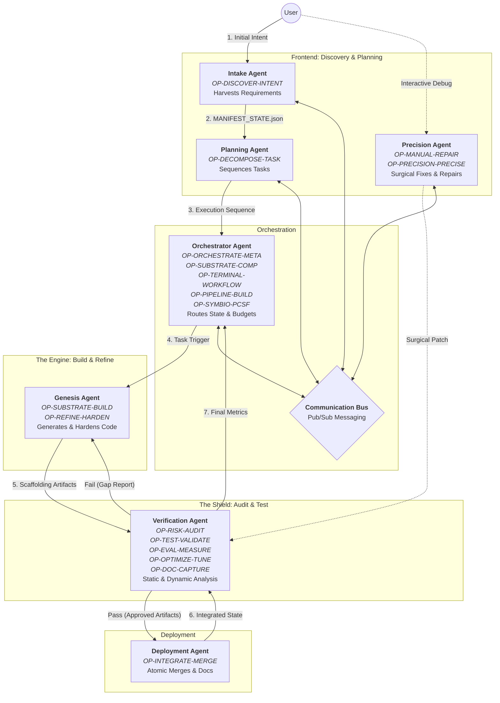

```mermaid
graph TD
%% Actors
User((User))

%% Subsystems
subgraph Frontend_Layer [Frontend: Discovery & Planning]
Intake[<b>Intake Agent</b><br/><i>OP-DISCOVER-INTENT</i><br/>Harvests Requirements]
Planning[<b>Planning Agent</b><br/><i>OP-DECOMPOSE-TASK</i><br/>Sequences Tasks]
Precision[<b>Precision Agent</b><br/><i>OP-MANUAL-REPAIR</i><br/><i>OP-PRECISION-PRECISE</i><br/>Surgical Fixes & Repairs]
end

subgraph Core_Brain [Orchestration]
Orch[<b>Orchestrator Agent</b><br/><i>OP-ORCHESTRATE-META</i><br/><i>OP-SUBSTRATE-COMP</i><br/><i>OP-TERMINAL-WORKFLOW</i><br/><i>OP-PIPELINE-BUILD</i><br/><i>OP-SYMBIO-PCSF</i><br/>Routes State & Budgets]
Bus{<b>Communication Bus</b><br/>Pub/Sub Messaging}
end

subgraph Build_Loop [The Engine: Build & Refine]
Genesis[<b>Genesis Agent</b><br/><i>OP-SUBSTRATE-BUILD</i><br/><i>OP-REFINE-HARDEN</i><br/>Generates & Hardens Code]
end

subgraph Safety_Layer [The Shield: Audit & Test]
Verify[<b>Verification Agent</b><br/><i>OP-RISK-AUDIT</i><br/><i>OP-TEST-VALIDATE</i><br/><i>OP-EVAL-MEASURE</i><br/><i>OP-OPTIMIZE-TUNE</i><br/><i>OP-DOC-CAPTURE</i><br/>Static & Dynamic Analysis]
end

subgraph Finalization [Deployment]
Deploy[<b>Deployment Agent</b><br/><i>OP-INTEGRATE-MERGE</i><br/>Atomic Merges & Docs]
end

%% Data Flow Connections
User -->|1. Initial Intent| Intake
Intake -->|2. MANIFEST_STATE.json| Planning
Planning -->|3. Execution Sequence| Orch
Orch -->|4. Task Trigger| Genesis
Genesis -->|5. Scaffolding Artifacts| Verify
Verify -- "Fail (Gap Report)" --> Genesis
Verify -- "Pass (Approved Artifacts)" --> Deploy
Deploy -->|6. Integrated State| Verify
Verify -->|7. Final Metrics| Orch

%% Precision Intervention
User -.->|Interactive Debug| Precision
Precision -.->|Surgical Patch| Verify

%% Bus Connections
Intake <--> Bus
Planning <--> Bus
Precision <--> Bus
Orch <--> Bus
```